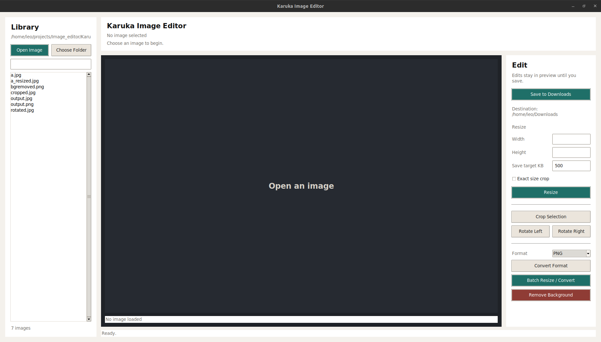

# Karuka Image Editor

Karuka Image Editor is a small Python desktop app for common image editing tasks:

- open and browse local image folders
- resize images with optional exact-size crop
- batch resize folders into another folder while keeping file names
- crop with a drag selection
- rotate left or right
- convert images to JPEG, JPG, PNG, or HEIC
- remove backgrounds with the optional `rembg` extra
- save edited output to the user's Downloads folder

## Screenshot



## Requirements

- Python 3.10 or newer
- Tkinter, usually included with Python. On some Linux distributions it is a separate system package such as `python3-tk`.

## Install From Source

```bash
python -m pip install .
```

For AI background removal support:

```bash
python -m pip install ".[bgremove]"
```

For HEIC input/output support:

```bash
python -m pip install ".[heic]"
```

For all optional image features:

```bash
python -m pip install ".[all]"
```

For packaging and publishing checks:

```bash
python -m pip install ".[dev]"
```

## Run

After installation:

```bash
karuka-editor
```

From a source checkout:

```bash
python main.py
```

## Batch Resize And Convert

Use **Batch Resize / Convert** in the editor panel to choose a source folder, output folder, target size, exact-size crop mode, and output format.

The output folder defaults to `Downloads/karuka_batch_output`. Files are saved with the same base name and the selected output extension, for example `photo.png` becomes `photo.jpeg` when JPEG is selected.

HEIC support depends on the optional `pillow-heif` package.

## Package Layout

```text
core/   Image operation helpers
ui/     Tkinter application interface
utils/  Shared utility package
misc/   Experimental command-line scripts
```

The distribution metadata lives in `pyproject.toml`. Package discovery includes `core`, `ui`, `utils`, and `misc`, and the top-level `main.py` module provides the `karuka-editor` console command.

## Build

```bash
python -m build
```

The generated `dist/` directory is ignored by git.

## Project Status

This project is early-stage software. Public APIs and packaging details may change before a `1.0.0` release.

## Contributing

Contributions are welcome. Please read `CONTRIBUTING.md` before opening a pull request.

## Contact

Maintainer: leo22092 <tkm22092@gmail.com>

## License

Released under the MIT License. See `LICENSE`.
